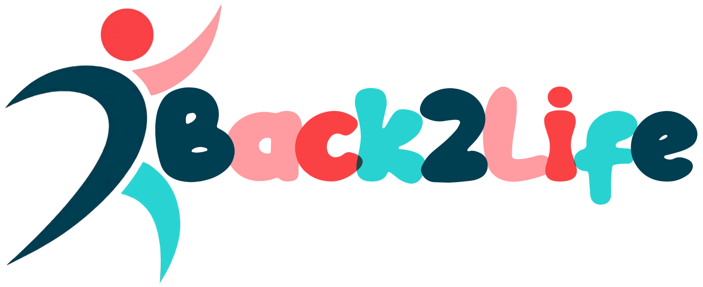

  

<a href="#english">English version ↓</a>

# &rlm;מחיקת חשבון — Back2Life

&rlm;עמוד זה מסביר איך למחוק את החשבון ואת כל הנתונים של האפליקציה **Back2Life** (מזהה חבילה:
`com.back2life.app`&rlm;), שפותחה ומתוחזקת על ידי מפתחת פרטית: רנה דבש.

&rlm;לאפליקציה אין שרת של המפתחת. הנתונים שלך נמצאים רק במכשיר שלך ובתיקייה בחשבון ה-Google Drive
שלך, ולכן המחיקה מתבצעת על ידך ונכנסת לתוקף מיד.

> &rlm;**סטטוס נכון ל-29.09.2026:** ההתחברות עם Google והשמירה ב-Google Drive עדיין אינן פעילות
> בגרסה המופצת של האפליקציה. עד להפעלתן כל הנתונים נשמרים במכשיר בלבד, והסרת האפליקציה מוחקת אותם.
> ההוראות שלהלן מתארות את ההתנהגות המתוכננת לאחר ההפעלה.

## &rlm;אפשרות א׳: מחיקה מתוך האפליקציה (מומלץ)

&rlm;_זמינה לאחר הפעלת רכיב Google (ראו הערת הסטטוס למעלה)._

1. &rlm;פתח/י את האפליקציה ועבור/י אל **הגדרות**.
2. &rlm;בחר/י **"מחיקת חשבון"**.
3. &rlm;אשר/י את המחיקה פעמיים (אישור כפול).

&rlm;די לעשות זאת בטלפון **אחד**. התוצאה:

- &rlm;כל קובצי הנתונים של Back2Life ב-Google Drive שלך נמחקים **לצמיתות**. הם **אינם** עוברים לאשפה של
  Drive&rlm;, ולכן אין מה לרוקן אחר כך.
- &rlm;התיקייה "Back2Life – סנכרון נתונים" והקובץ הקטן `account.json` נשארים. הקובץ מכיל רק מזהה
  אקראי וחותמת זמן, ללא מידע אישי, והוא מאפשר לטלפונים האחרים שלך לדעת שהחשבון נמחק. אפשר למחוק
  את התיקייה ידנית לאחר מכן, אבל מומלץ להמתין עד שכל הטלפונים שלך התחברו לאינטרנט, כדי שכל אחד
  מהם יספיק לגלות שהחשבון נמחק.
- &rlm;כל הנתונים המקומיים בטלפון הזה נמחקים, ואת/ה מנותק/ת מהחשבון.
- &rlm;כל טלפון אחר שמחובר לאותו חשבון מוחק בעצמו את הנתונים המקומיים שלו ומתנתק בפעם הבאה שהוא
  מתחבר לאינטרנט, במקום להעלות שוב את הנתונים שלו. טלפון שנשאר ללא חיבור שומר את הנתונים
  המקומיים שלו עד שיתחבר.

&rlm;בטלפון שלא יתחבר לאינטרנט לעולם יש עדיין לנקות את נתוני האפליקציה או להסיר אותה.

## &rlm;אפשרות ב׳: מחיקה בלי האפליקציה

&rlm;יש לבצע את השלבים **לפי הסדר**:

1. &rlm;**בכל טלפון שבו Back2Life מותקנת:** אם האפליקציה נפתחת — השתמש/י באפשרות א׳. אם לא — פתח/י
   את הגדרות Android ← אפליקציות ← Back2Life ← אחסון ← **ניקוי נתונים**, ואז הסר/י את האפליקציה.
   שלב זה בא ראשון, כי אחרת האפליקציה תעלה שוב את הנתונים בהפעלה הבאה שלה.
2. &rlm;**ב-Google Drive:** מחק/י את התיקייה **"Back2Life – סנכרון נתונים"**, ולאחר מכן רוקן/י אותה
   מהאשפה של Drive (מחיקה ידנית ב-Drive כן עוברת דרך האשפה).
3. &rlm;**ביטול הגישה:** הסר/י את Back2Life בעמוד
   [הרשאות חשבון Google](https://myaccount.google.com/permissions), כדי שטלפון ששכחת לא יוכל
   להמשיך לסנכרן.

> &rlm;**אזהרה:** מחיקת התיקייה ב-Drive בלבד, כשהאפליקציה עדיין מותקנת ומחוברת בטלפון כלשהו, אינה
> מוחקת את הנתונים שלך. האפליקציה תיצור את התיקייה מחדש ותעלה אליה שוב את הנתונים. מחיקה ישירה של
> התיקייה בענן מחייבת להסיר קודם את האפליקציה מכל מכשיר שהיא מותקנת בו, כדי שהנתונים לא יסונכרנו
> שוב פנימה.

## &rlm;מה נמחק ומה נשמר

- &rlm;**נמחק:** הכול — הנתונים במכשיר (כולל פרטי חשבון Google ששמורים בו), וכל קובצי הנתונים של
  Back2Life ב-Google Drive שלך.
- &rlm;**נשמר אצל המפתחת:** שום דבר. אין לנו שרת ואין לנו עותק של הנתונים שלך. לאחר אפשרות א׳
  נשארים ב-Drive שלך רק התיקייה הריקה והקובץ `account.json` (ללא מידע אישי), עד שתמחק/י אותם.

## &rlm;עזרה

&rlm;לשאלות אפשר לפנות אל [back2lifesupport@gmail.com](mailto:back2lifesupport@gmail.com)&rlm;. נשמח
להדריך אותך בתהליך, אבל אין לנו גישה לחשבון Google, ל-Drive או לנתונים שלך, ולכן איננו יכולים
למחוק אותם עבורך.

&rlm;למידע נוסף: [מדיניות הפרטיות](index.md)&rlm;.

---

# Delete account — Back2Life

This page explains how to delete your account and all data of the **Back2Life** app (package
`com.back2life.app`), developed and maintained by an individual developer, Rene Dvash.

The app has no developer server. Your data exists only on your device and in a folder in your own
Google Drive, so deletion is done by you and takes effect immediately.

> **Status as of 29.09.2026:** the Google sign-in and Google Drive storage are not yet active in the
> distributed version of the app. Until they are, all data is stored on the device only, and
> uninstalling the app deletes it. The instructions below describe the planned behavior once they
> are active.

## Option A: delete in the app (recommended)

_Available once the Google component is active (see the status note above)._

1. Open the app and go to **Settings**.
2. Choose **"מחיקת חשבון"** (Delete account).
3. Confirm twice (double confirmation).

You only need to do this on **one** phone. The result:

- All Back2Life data files in your Google Drive are deleted **permanently**. They do **not** go to
  Drive's trash, so there is nothing to empty afterwards.
- The folder "Back2Life – סנכרון נתונים" and the small `account.json` file remain. The file holds
  only a random identifier and a timestamp, no personal data, and it lets your other phones learn
  that the account was deleted. You may delete the folder manually afterwards, but we recommend
  waiting until all your phones have connected to the internet, so that each of them has a chance
  to learn that the account was deleted.
- All local data on that phone is deleted, and you are signed out.
- Every other phone signed in to the same account deletes its own local data and signs out the next
  time it connects to the internet, instead of uploading its data again. A phone that stays
  offline keeps its local data until it connects.

On a phone that will never connect to the internet again, you still need to clear the app's data or
uninstall the app.

## Option B: delete without the app

Follow these steps **in this order**:

1. **On every phone where Back2Life is installed:** if the app opens, use Option A. If it does not,
   open Android Settings → Apps → Back2Life → Storage → **Clear data**, then uninstall the app.
   This step comes first because otherwise the app uploads the data again the next time it runs.
2. **In Google Drive:** delete the folder **"Back2Life – סנכרון נתונים"**, then empty it from
   Drive's trash (manual deletion in Drive does go through the trash).
3. **Revoke access:** remove Back2Life at
   [Google Account permissions](https://myaccount.google.com/permissions), so that a forgotten
   phone can no longer sync.

> **Warning:** deleting only the Drive folder while the app is still installed and signed in on any
> phone does not delete your data. The app will recreate the folder and upload the data again. To
> delete the folder directly in the cloud, first remove the app from every device where it is
> installed, so that the data is not synced back in.

## What is deleted and what is kept

- **Deleted:** everything — the data on your device (including the Google account details stored
  there), and all Back2Life data files in your Google Drive.
- **Kept by the developer:** nothing. We run no server and hold no copy of your data. After Option
  A, only the empty folder and the `account.json` file (no personal data) stay in your Drive until
  you delete them.

## Help

Questions: [back2lifesupport@gmail.com](mailto:back2lifesupport@gmail.com). We are happy to guide
you through the process, but we have no access to your Google account, your Drive or your data, so
we cannot delete it for you.

More information: [Privacy Policy](index.md#english).

  

